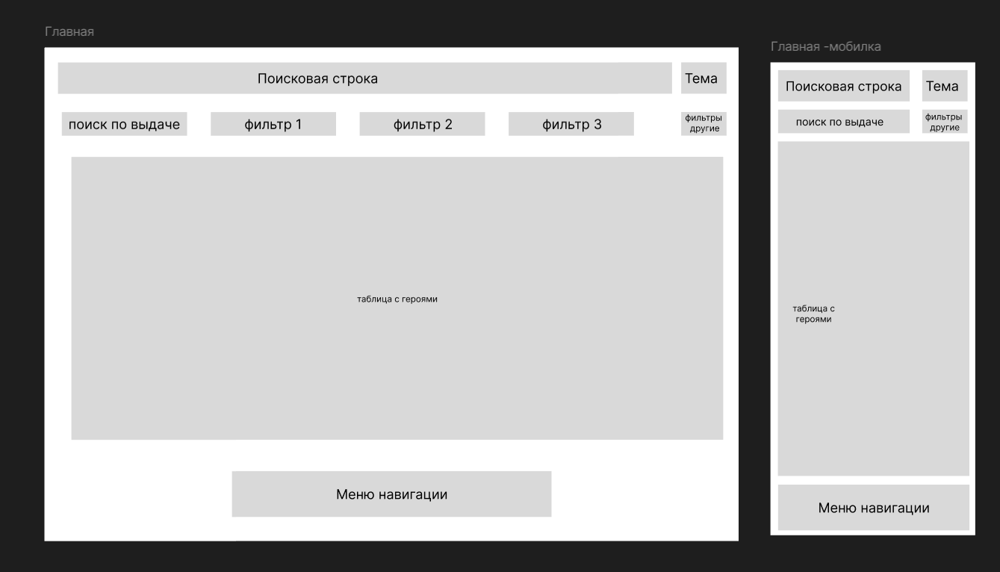
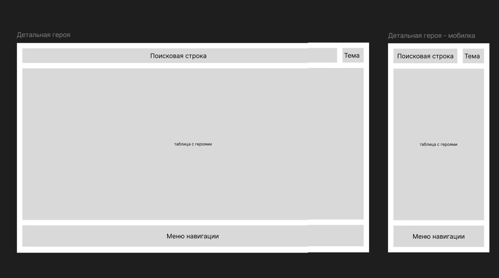
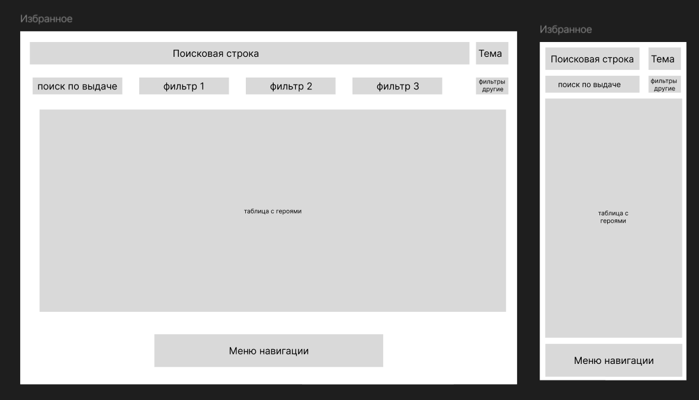
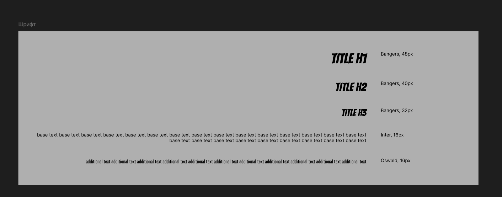
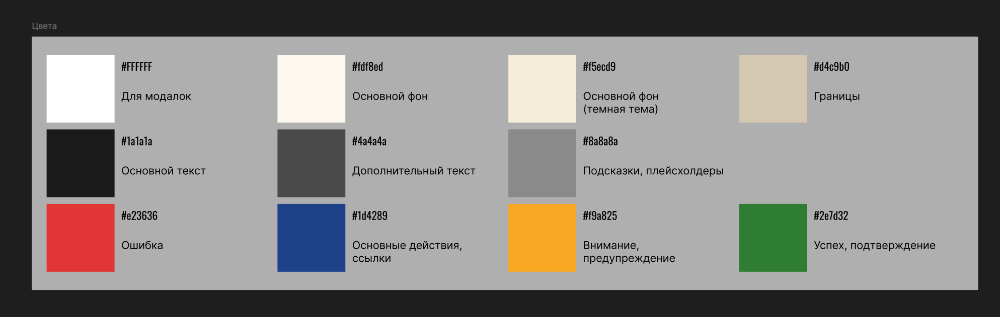

# Marvel Heroes — Vue 3

**Spectrum of Heroes: The Interactive Gallery**

Marvel Heroes — это интерактивная галерея персонажей вселенной Marvel, объединяющая современный фронтенд с необычной
визуальной концепцией. Проект создан в рамках pet-проекта для демонстрации навыков работы с Vue 3, TypeScript, Vitest,
Element Plus, виртуализацией списков, сложной фильтрацией и созданием команд.

Проект вдохновлён комиксами, цветовым восприятием, спортивной статистикой.

---

## 🧩 Основной функционал

- **Общий поиск** по имени / псевдониму / реальному имени героя.
- **Фильтрация** по командам, уровню силы, цветовой гамме костюма.
- **Сортировка** по силе, интеллекту, популярности, году первого появления.
- **Виртуализация списка** (десятки героев без потери производительности).
- **Последовательная загрузка** (lazy loading / infinite scroll).
- **Добавление в избранное** (хранится в Pinia + localStorage).
- **Составление команд** из 3–6 героев с drag-and-drop.
- **Статистика команды** (суммарная сила, скорость, интеллект, уникальные способности).
- **Страница героя** с детальной информацией, графиками и цветовой ассоциацией.

---

## 🧱 Технологический стек

| Технология        | Назначение                                     |
|-------------------|------------------------------------------------|
| Vue 3             | Фреймворк (Composition API, `<script setup>`)  |
| Vite              | Сборка и dev-сервер                            |
| TypeScript        | Типизация и автодополнение                     |
| Pinia             | Управление состоянием (избранное, команды)     |
| Vue Router        | Маршрутизация                                  |
| Element Plus      | UI-библиотека (таблицы, формы, кнопки, иконки) |
| Vitest            | Модульное тестирование                         |
| ESLint + Prettier | Качество и стиль кода                          |

---

## 📌 Статус реализации

-[x] Инициализация проекта (Vue 3 + Vite + TS)
-[x] Настройка ESLint + Prettier
-[x] Подключение Element Plus
-[x] Настройка маршрутизации
-[x] Подключение локальных данных, заполнение данными, получение данных
-[ ] Реализация главной страницы и поиска, фильтрация, сортировка, поиск по результатам
-[ ] Страница героя, вывод данных по герою
-[x] Настройка хранилища Pinia
-[ ] Реализация страницы избранного, добавление, удаление героя
-[ ] Реализация страницы команд, фильтрация, поиск по названию команды или герою, сортировка по общим свойствам команды
-[ ] Реализация детальной страницы команды, с графиками, диаграммами
-[ ] Тесты на модуль, композаблы (Vitest)

---

## 📁 Структура проекта (основные папки)

```
src/
├── components/ # переиспользуемые компоненты (HeroCard, TeamBuilder)
├── composables/ # кастомные хуки (useHeroes, useVirtualScroll)
├── constants/ # константы для переиспользования
├── stores/ # Pinia (favorites, team)
├── types/ # TypeScript-типы (Hero, Team, Filter)
├── pages/ # страницы (Home, HeroPage, TeamPage)
├── App.vue
└── main.ts
```

---

## 🖼️ Прототипы

https://www.figma.com/design/3aycOZGQX7DmRk5FOq76PS/MARVEL?node-id=0-1&t=J9gJXXjdQ5WKV0Yx-1




---

## ✒️ Шрифты и типографика

Шрифтовая система построена на комбинации динамичных заголовков и читаемого основного текста.



---

## 🖌️ Цвета

Основная палитра проекта вдохновлена комиксной бумагой и супергеройскими акцентами.


---

## 🧪 Запуск проекта

```bash
# Установка зависимостей
npm install

# Запуск dev-сервера
npm run dev

# Сборка проекта
npm run build

# Предпросмотр собранного проекта
npm run preview

# Запуск тестов
npm run test

# Линтинг и автофикс
npm run lint
```

---

## 📄 Лицензия

MIT — разрешено свободное использование, изучение и модификация.

---

## ⚠️ Важное юридическое замечание

> **Marvel, все персонажи, названия, логотипы и изображения являются товарными знаками и/или зарегистрированными
товарными знаками Marvel Entertainment, LLC. Данный проект создан исключительно в образовательных и портфолио-целях.
Автор не претендует на права интеллектуальной собственности в отношении вселенной Marvel. Проект не связан с Marvel
Entertainment, LLC и не приносит коммерческой выгоды.**

---